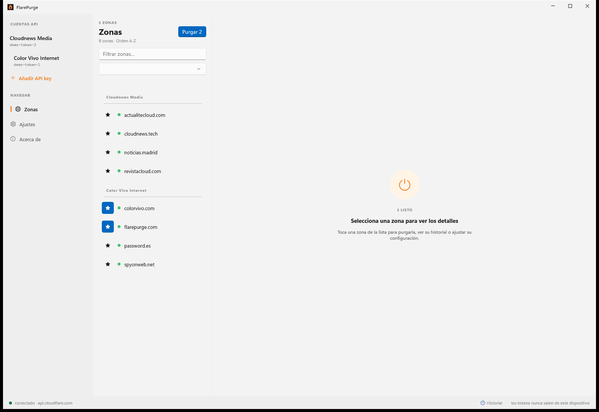
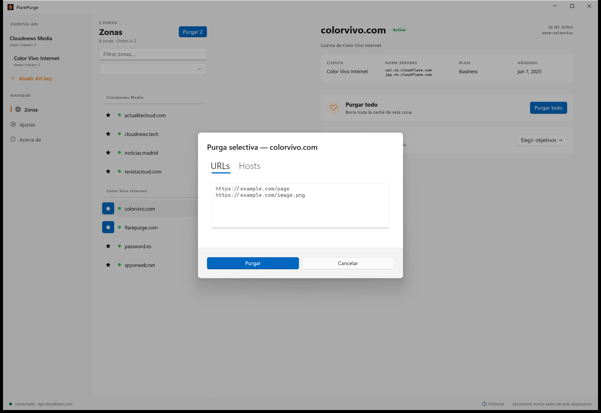
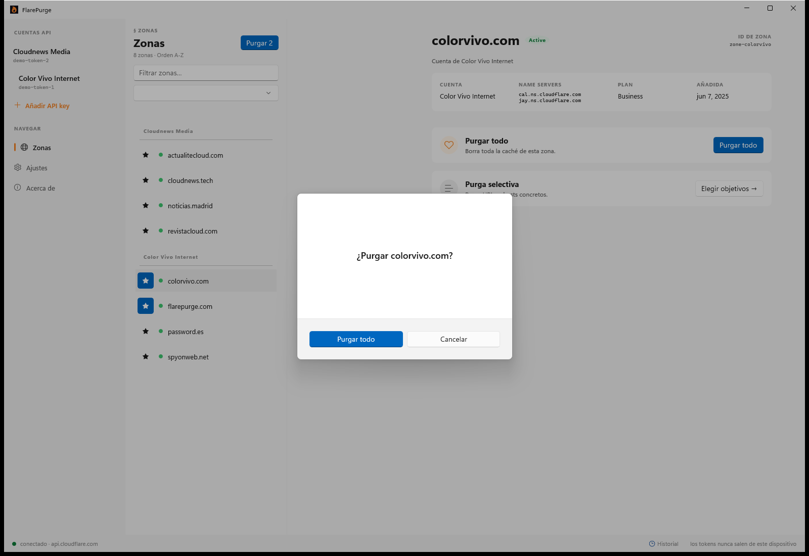
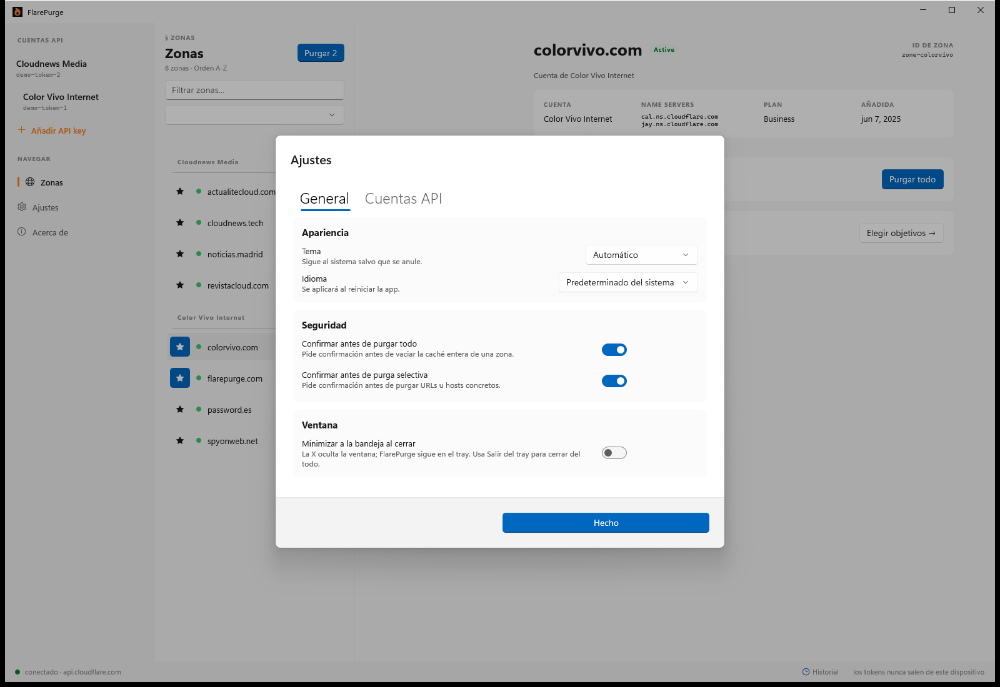

# FlarePurge for Windows

**FlarePurge** is a focused, native Windows app for purging Cloudflare cache — nothing more, nothing less. One job, done well: clear your cache in a click, without opening a browser or the Cloudflare dashboard.

No analytics, no tracking, no third-party SDKs. The only outbound requests go to `api.cloudflare.com` and to `flarepurge.com/status.json` (a remote kill switch). Your API tokens live in the Windows Credential Locker, never in a config file.

> **Download pre-built versions from [flarepurge.com](https://flarepurge.com)** — the
> website links to the current Microsoft Store listing and to signed sideload
> builds. You don't need to compile anything to use FlarePurge.
>
> **Apple (macOS & iOS) and Android are coming soon** — this Windows edition is the first to go open source under the MIT license. The other platforms will follow in their own repositories.

## Screenshots

|  |  |
|---|---|
|  |  |
|  |  |

## Features

- **Purge everything** — clear a zone's entire cache in one click.
- **Selective purge** — by URL (batched automatically) or by host.
- **Multi-account** — add several API tokens, switch between them, automatic grouping when a token spans multiple Cloudflare accounts.
- **Favorites** — star zones and bulk-purge them ("Purge N favorite zones" / "Purge all zones in account X").
- **Session history** — timestamp, result and purge ID for each operation.
- **System tray companion** — quick-purge from the tray without opening the main window; minimize-to-tray on close (optional).
- **Keyboard shortcuts** — reload, search, settings, jump-to-favorite, quick purge.
- **21 languages**, live theme switching (Auto / Light / Dark), optional confirm-before-purge.
- **Accessibility baseline** — AutomationProperties, contrast, touch targets.

## Security

- API tokens stored in the **Windows Credential Locker** (`PasswordVault`, backed by DPAPI) — never on disk in plain text.
- **Certificate pinning** (SPKI SHA-256) against `api.cloudflare.com`.
- Use a scoped **Cloudflare API token** with only *Cache Purge* permissions — never your Global API Key.

## Stack

- **WinUI 3** + **Windows App SDK**, **C# 13**, **.NET 10**.
- Targets **Windows 10 21H2 (build 19041)** and above; Fluent Design (Mica on Windows 11, Acrylic fallback on Windows 10).
- **HttpClient** with certificate pinning; **CommunityToolkit.Mvvm** (`ObservableObject` + `RelayCommand`); `Microsoft.Extensions.DependencyInjection`.
- **xUnit** + **FluentAssertions** for tests.

## Project layout

```
flarepurge-windows/
├── FlarePurge.sln
├── global.json                  # .NET SDK pin
├── Directory.Build.props        # Shared config (versioning, C# 13, nullable)
├── .editorconfig                # C# naming + formatting rules
├── .github/workflows/build.yml  # CI on windows-latest (build + test + MSIX)
└── src/
    ├── FlarePurge.Core/         # Domain + Cloudflare API client
    ├── FlarePurge.App/          # WinUI 3 app (Themes, Strings, Assets, views)
    └── FlarePurge.Tests/        # xUnit + FluentAssertions
```

## Build

Requires **Windows 10/11** with the **.NET 10 SDK** and **Visual Studio 2022** (Windows App SDK / WinUI workload) for the app project.

```powershell
git clone https://github.com/colorvivo/flarepurge-windows.git
cd flarepurge-windows

# Core (portable .NET) + tests
dotnet restore
dotnet build src/FlarePurge.Core/FlarePurge.Core.csproj
dotnet test  src/FlarePurge.Tests/FlarePurge.Tests.csproj

# App (WinUI 3 — requires msbuild)
msbuild src/FlarePurge.App/FlarePurge.App.csproj `
  /p:Configuration=Debug /p:Platform=x64 /restore
```

CI builds and tests on every push and produces a sideloadable MSIX artifact — see [`.github/workflows/build.yml`](.github/workflows/build.yml).

## Contributing

Contributions are welcome — see [CONTRIBUTING.md](CONTRIBUTING.md). FlarePurge stays deliberately narrow: **it only purges cache.** DNS, WAF, analytics and other Cloudflare features are out of scope by design.

## License

Released under the [MIT License](LICENSE). Copyright © 2026 Color Vivo Internet, SL.

Cloudflare is a trademark of Cloudflare, Inc. FlarePurge is an independent project and is not affiliated with or endorsed by Cloudflare, Inc.
